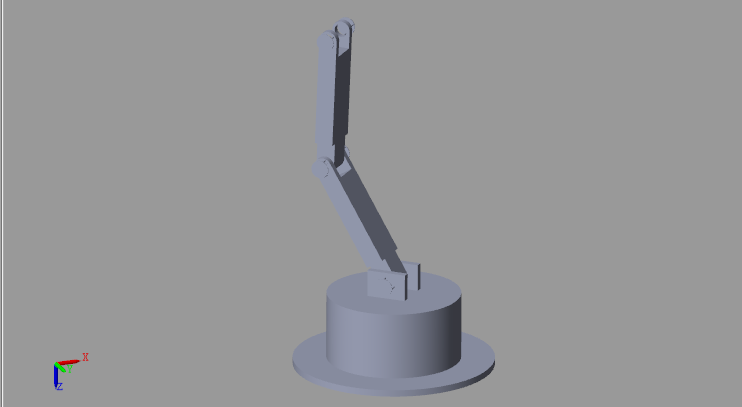
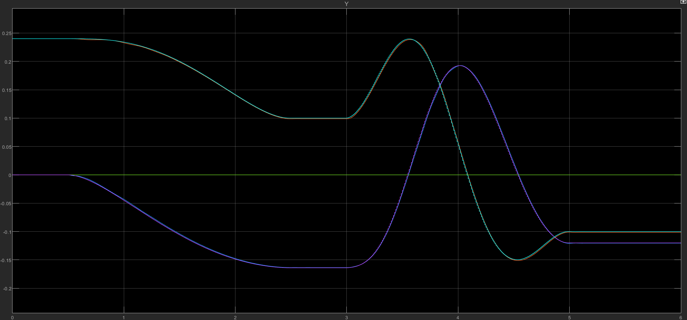
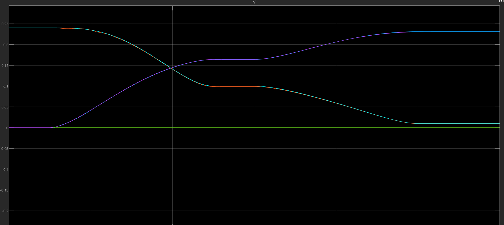
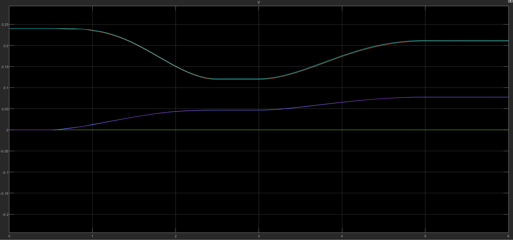

# Optimal trajectory generator and optimal control for manipulator

## Contributors

The two contributors are:
1. Nguyen Viet Tung - https://github.com/VTNguyen490
2. Nguyen Viet Bach - link to Github page

## Description
This project aim to develop an algorithm for generating an optimal trajectory and controlling the dynamics of the robot arm to follow that trajectory with a given start and end pose of the end-effector. In this project specifically, we are generating trajectory and controlling for two DoF plannar robot arm for simplicity; However, the same algorithm can be applied to manipulators with any number of DoF as long as we have the access to its dynamic. In this project, the manipulator are working in an obstacles-free configuration space and we have full acess to the state information.

  
    
  <figcaption> Manipulator for the project</figcaption>

  

The code implemetation and simulation of this project will be done in simulink. The two links have the exact same mechanical properties as following
- $mass = 2.45 kg$
- $l = 0.12 m$
- $l_C = 0.06m$
- Inertia Tensor

$$
I_C = 
\begin{bmatrix}
0.008 & 0 & 0 \\
0 & 0.008 & 0 \\
0 & 0 & 0
\end{bmatrix}$$

There is no limit to the angle of each revolute join.

## Generating Optimal trajectory

**Model of the manipulator for trajectory generator**

For the modelling of the system for generating trajectory, we assume that we can control directly the angular velocity of the actuator of each link. Manipulators are holonomic system, therefore, our state in this case are the angle of each actuator of each link, the output of our system is the end effector position:

$$
\begin{bmatrix}
\dot \theta 1\\
\dot \theta 2
\end{bmatrix} = 
\begin{bmatrix}
\omega 1\\
\omega 2
\end{bmatrix}$$ 

$$
y = 
\begin{bmatrix}
l_2cos(\theta _1 + \theta _2) + l_1cos(\theta _1)\\
l_2sin(\theta _1 + \theta _2) + l_1sin(\theta _1)
\end{bmatrix}
$$

After discretize the system, we have the disrete time system:

$$\begin{bmatrix}
\theta 1 (k+1)\\
\theta 2 (k+1)
\end{bmatrix} = 
\begin{bmatrix}
\theta 1 (k)\\
\theta 2 (k)
\end{bmatrix} +
T\begin{bmatrix}
\omega 1(k)\\
\omega 2(k)
\end{bmatrix}$$ 

$$
y(k) = 
\begin{bmatrix}
l_2cos(\theta 1(k) + \theta 2 (k)) + l_1cos(\theta 1(k))\\
l_2sin(\theta 1(k) + \theta 2(k)) + l_1sin(\theta 1(k))
\end{bmatrix}
$$

**Designing the cost function**

For the cost function, the first part of the cost function is to optimize the length of path that is generted by the trajectory generator. Natualy, the cost function for this should be $\sum_{n=1}^{N} \sqrt{(y_n-y_{n-1})^T Q_n (y_n-y_{n-1})}$ where N is the number of steps to reach goal position and Q is a symetric, positive definite matrix. However, because we need the trajectory and not just the path, we have to add a term in order to penalize long distance to prevent situations such as the manipulator remain in the start position for the entire runtime and move extremely fast to the goal point in the last time step. Therefore, our cost function for this part should be:

$$
\sum_{n=1}^{N} \underbrace{\sqrt{(y_n-y_{n-1})^T Q_n (y_n-y_{n-1})}}_\text{Length of the path}
                 \underbrace{ \sqrt{(y_n-y_{n-1})^T Q_n (y_n-y_{n-1})}}_\text{Penalize long distance}
$$

or

$$\sum_{n=1}^{N} (y_n-y_{n-1})^T Q_n (y_n-y_{n-1})$$

Since $y_0$ is a constant, we can take the term $y_0$ out so our cost function becomes

$$\sum_{n=2}^{N} (y_n-y_{n-1})^T Q_n (y_n-y_{n-1}) +  y_1^T Q_1y_1 -  y_1^T Q_1y_0 - y_0^T Q_1y_1 + y_0^T Q_1y_0$$

Because we have

$$
\begin{bmatrix}
y_1\\
y_2 - y_1\\
...\\
y_{N-1} - y_{N-2}\\
y_N - y_{N-1}
\end{bmatrix} = 
\underbrace {\begin{bmatrix}
I&0&0&0&...&0&0\\
-I & I & 0 & 0 &...& 0&0\\
0&-I&I&0&...&0&0\\
...&...&...&...&...&...&...\\
0&0&0&0&...&-I&I
\end{bmatrix}}_\text{W}
\begin{bmatrix}
y_1\\
y_2\\
...\\
y_{N-1}\\
y_N
\end{bmatrix}
$$

Using the matrix W and removing the constant term $y_0^T Q_1y_0$, we can rewrite the equation in a more compact form

$$
J_y = y^T Q^\prime y - y_0^T Q_1y_1 - y_1^T Q_1y_0
$$

where $Q^\prime = W^TQW$  and is also symetric, positive definite.

The second part of the cost function is to limit the change in angular velocity and also to get the angular velocity of the last time step close to 0

$$
J_u = (\sum_{n=0}^{N-1} (u_n-u_{n-1})^T R_n (u_n-u_{n-1}) )+ u_{N-1}^TPu_{N-1}
$$

where R and P are symetric, positive definite matrices of appropriate dimensions and $u_{-1} = 0$ (At the start, the manipulator is static). Similar to before, we have

$$
J_u = u^TR^\prime u+ u_{N-1}^T P u_{N-1}
$$

where $R^\prime = W^T RW$ and P is also positve definite.

With that, we have our cost function

$$
J = y^T Q^\prime y - y_0^T Q_1y_1 - y_1^T Q_1y_0 + u^TR^\prime u+ u_{N-1}^T Pu_{N-1}
$$

**Iterative LQR and its solution**

In this situation, our cost function is nonlinear and can be difficult to solve; therefore, in this project, we use iLQR (iterative LQR) in order to linearize the system. We won't present the specific of iLQR, but the main idea is to:

- First, Initialize one trajectory.

- At each time step, linearize the system around the current state.

- Calculate the optimal pertubation of the input $\delta u$ with the cost function being $J(u + \delta u)$ where u is the input use to generate the previous trajectory.

- Update the trajectory with the input being $u + \delta u$ and repeat the process until convergence.

In this project, we won't discuss the conditon for convergence of the system but just assume that with a sufficiently large iterations, the system will converge.

Applying the iLQR algorithm, at each time step k we have

$$
dy_k = C_k dx_k 
$$

or 

$$
\delta y_k = C_k \delta x_k
$$

where $C_k$ is the Jacobian of y with respect to $x$ at $x_k$.

Fortunately, our state $x_{k+1}$ is already linear with regard to $x_k$ and $u_k$. Let our linear system be in a generalized form

$$
x_{k+1} = Ax_k +Bu_k
$$

Because the system is linear, we have

$$
\delta x_{k} = A \delta x_{k-1} + B \delta u_{k-1} 
$$

Now we can derive $\delta x_k$ from the pertubation of the input.

$$
\begin{aligned}
\delta x_k = A^2 \delta x_{k-2} + A B \delta u_{k-2} + B u_{k-1}\\
\hspace{2.5 cm } = ... = A^k \delta x_0 + A^{k-1} B \delta u_0 + A^{k-2} B \delta u_1 + ... +  A B \delta u_{k-2} + B u_{k-1} \\
\hspace{0.5 cm} =  A^{k-1} B \delta u_0 + A^{k-2} B \delta u_1 + ... +  A B \delta u_{k-2} + B u_{k-1}
\end{aligned}
$$

The last line is the result of the fact that $x_0$ doesn't depend on u thus $\delta x_0 = 0$. Therefore, we have

$$
\delta y_k = C_k (A^{k-1} B \delta u_0 + A^{k-2} B \delta u_1 + ... +  A B \delta u_{k-2} + B u_{k-1})
$$

Now we have the equation for the pertubation of the output $\delta y$

$$
\delta y = 
\begin{bmatrix}
\delta y_1\\
\delta y_2\\
...\\
\delta y_N
\end{bmatrix} = 
\underbrace {\begin{bmatrix}
C_1 B& 0 & ... & 0 & 0 \\
C_2 A B& C_2 B & ... & 0 & 0\\
... & ... & ...& ...& ...\\
C_N A^{N-1}B & C_N A^{N-2} B& ... & C_N A B & C_N B
\end{bmatrix}}_\text{M}
\begin{bmatrix}
\delta u_0\\
\delta u_1\\
...\\
\delta u_{N-1}
\end{bmatrix} = 
M \delta u
$$

With that, our cost function now is

$$
\begin{aligned}
J[\delta u] = (y+\delta y)^T Q^\prime (y+\delta y) + (u+\delta u)^T R^\prime (u+\delta u) + (u_{N-1} + \delta u_{N-1})^T P (u_{N-1} + \delta u_{N-1})  - y_0^T Q_1 (y_1 + \delta y_1) - (y_1 + \delta y_1)^T Q_1 y_0  \\
 = (y+M\delta u)^T Q^\prime (y+M\delta u) + (u+\delta u)^T R^\prime (u+\delta u) + (u_{N-1} + \delta u_{N-1})^T P (u_{N-1} + \delta u_{N-1})  - y_0^T Q_1 (y_1 + C_1 B\delta u_0) - (y_1 + C_1 B\delta u_0)^T Q_1 y_0 
 \end{aligned}
$$

Assume our initial trajectory satisfies the constraint $y_N = p$ where p is the end position. We add a Lagrange multiplier term for the constraint $\delta y_N = 0$. Our equivalent unconstraint cost function is

$$
 J(\delta u, \lambda) = (y+M\delta u)^T Q^\prime (y+M\delta u) + (u+\delta u)^T R^\prime (u+\delta u) + (u_{N-1} + \delta u_{N-1})^T P (u_{N-1} + \delta u_{N-1})  - y_0^T Q_1 (y_1 + C_1 B\delta u_0) - (y_1 + C_1 B\delta u_0)^T Q_1 y_0 + \lambda \delta y_N 
$$

Taking the derivative of the function with respect to $\delta u$ and $\lambda$ and setting both to 0, we obtain the system of equation:

$$
2(y+M\delta u)^T Q^\prime M + 2(u+\delta u)^T R^\prime + 
\begin{bmatrix}
0 & 0 & ... & 0 & 2(u_{N-1} + \delta u_{N-1})^T P
\end{bmatrix} -
\begin{bmatrix}
2y_0^T Q_1 C_1 B & 0 & ... & 0 & 0
\end{bmatrix} +
\lambda \begin{bmatrix}
C_N A^{N-1}B & C_N A^{N-2} B& ... & C_N A B & C_N B
\end{bmatrix} = 0
$$

$$
\begin{bmatrix}
C_N A^{N-1}B & C_N A^{N-2} B& ... & C_N A B & C_N B
\end{bmatrix} \delta u = 0
$$

Divide the first equation by the factor of 2 and taking the transpose we obtain

$$
M^T Q^\prime (y+M\delta u) + R^\prime (u+\delta u) + 
\begin{bmatrix}
0 \\
0 \\
...\\
0\\ 
P(u_{N-1} + \delta u_{N-1})
\end{bmatrix} -
\begin{bmatrix}
(C_1 B)^T Q_1 y_0\\
0 \\
... \\ 
0 \\
0
\end{bmatrix} + 
\begin{bmatrix}
(C_N A^{N-1}B)^T \\
(C_N A^{N-2} B)^T\\
 ...\\ 
(C_N A B)^T \\
(C_N B)^T
\end{bmatrix} \lambda 
= 0
$$

$$
\begin{bmatrix}
C_N A^{N-1}B & C_N A^{N-2} B& ... & C_N A B & C_N B
\end{bmatrix} \delta u = 0
$$

Taking all the constant part out of the first equation we obtain

$$
M^T Q^\prime (y+M\delta u) + R^\prime (u+\delta u) + 
\begin{bmatrix}
0 \\
0 \\
...\\
0\\ 
P\delta u_{N-1}
\end{bmatrix} + 
\begin{bmatrix}
(C_N A^{N-1}B)^T \\
(C_N A^{N-2} B)^T\\
 ...\\ 
(C_N A B)^T \\
(C_N B)^T
\end{bmatrix} \lambda 
= const
$$

$$
\begin{bmatrix}
C_N A^{N-1}B & C_N A^{N-2} B& ... & C_N A B & C_N B
\end{bmatrix} \delta u = 0
$$

We can write this system of linear equation in a more compact form

$$
\begin{bmatrix}
M^T Q^\prime M + R^\prime + K &
\begin{matrix}
(C_N A^{N-1}B)^T \\
(C_N A^{N-2} B)^T\\
 ...\\ 
(C_N A B)^T \\
(C_N B)^T
\end{matrix} \\
\begin{matrix}
C_N A^{N-1}B & C_N A^{N-2} B& ... & C_N A B & C_N B
\end{matrix} & 0
\end{bmatrix} 
\begin{bmatrix}
\delta u_0\\
\delta u_1\\
...\\
\delta u_{N-2}\\
\delta u_{N-1}\\
\lambda
\end{bmatrix} =
\begin{bmatrix}
const\\
0
\end{bmatrix}
$$

Where

$$
K = \begin{bmatrix}
0&0&...&0&0\\
0&0&...&0&0\\
...&...&...&...&...\\
0&0&...&0&0\\
0&0&...&0&P
\end{bmatrix}
$$

Therefore, we obtain our solution

$$
\begin{bmatrix}
\delta u_0\\
\delta u_1\\
...\\
\delta u_{N-2}\\
\delta u_{N-1}\\
\lambda
\end{bmatrix} =
\begin{bmatrix}
M^T Q^\prime M + R^\prime + K &
\begin{matrix}
(C_N A^{N-1}B)^T \\
(C_N A^{N-2} B)^T\\
 ...\\ 
(C_N A B)^T \\
(C_N B)^T
\end{matrix} \\
\begin{matrix}
C_N A^{N-1}B & C_N A^{N-2} B& ... & C_N A B & C_N B
\end{matrix} & 0
\end{bmatrix} ^{-1}
\begin{bmatrix}
const\\
0
\end{bmatrix}
$$

After obtaining the optimal perturbation of the input, we use it to update the input and calculate the new trajectory for the next iterations. For the implementation of the algorithm on matlab, we are repeating the described process for 50 iterations to obtain the final trajectory.

## Controlling the dynamics of the maipulators to follow the trajectory 

### Model of the manipulator for trajectory generator

For the modelling of the system for controlling the dynamics of the manipulators, we assume that we can control directly the output torque of the actuator of each link. Therefore, we are ignoring the dynamics of the electrical circuit and DC motors. Because the dynamics of manipulators are much more complicated than the kinematics, we are illustrating how to derive the dynamics of the manipulator in this case:

1. **Outward propagation to calculate velocity and acceleration**

Since in our case, all the links are revolute and rotate around the same Z axis, we can have a general way to propagate through every link. We will calculate the velocity, acceleration, angular velocity, angular aceleration at any given instant.

**It is important to note that in the propagation, each frame doesn't move with its corresponding link but is fixed. We are propagating at each instant of the fixed frame, which mean value such as $&#8201;^{i}\dot P_{i}$ is not equal to 0** 

$$
 ^{i+1}w_{i+1} =  ^{i+1}_iR  &#8201;^{i}w_{i} +\dot \theta _{i+1} &#8201;^{i+1}Z
$$

Where $&#8201;^{n}w_{m}$ denotes the angular velocity of the frame attached to link m with respect to frame n, $&#8201;^{A}_{B}R $ denotes frame B with respect to frame A. Taking the derivative, we have

$$
&#8201;^{i+1}\dot w_{i+1} = &#8201;^{i+1}_i\dot R &#8201;^{i} w_{i} + &#8201;^{i+1}_iR &#8201;^{i}\dot w_{i} +\ddot \theta _{i+1} &#8201; ^{i+1}Z
$$

Remember that for any vector P in a frame A undergo a rotation $\Omega _K$ around an abitrary frame K describe as 

$$
\begin{bmatrix}
\Omega _x\\
\Omega _y\\
\Omega _z\\
\end{bmatrix}$$

then it derivative is $&#8201;^A \dot  P = &#8201;^A \Omega _K \times &#8201;^A P $. However, in our case, instead of the vector P, the frame undergoes the rotation $\Omega _K$ so the derivative of vector P with respect to the frame should be $&#8201;^A \dot  P = -&#8201;^A \Omega _K \times &#8201;^A P $. As a result, we have

$$
&#8201;^{i+1}\dot w_{i+1} = &#8201;^{i+1}_{i}\dot R &#8201;^{i} w_{i} \times \dot \theta _{i+1} Z_{i+1} + &#8201;^{i+1}_i R &#8201;^{i}\dot w_{i} +&#8201;^{i+1}\ddot \theta _{i+1} &#8201; ^{i+1}Z
$$

Now, we move on to the derivation of velocity and acceleration

$$
&#8201;^{i+1}v_{i+1} = &#8201;^{i+1}_{i} R &#8201;^i v_{i} + &#8201;^{i+1}_i R (&#8201;^{i}w_{i} \times &#8201;^{i} P_{i+1})
$$

where $&#8201;^{i} P_{i+1}$ is the position of frame $i+1$ with regard to frame $i$. Because cross product can be considered as product with a correspond skew symmetric matrix, we can use normal rule to take the derivative.

$$
&#8201;^{i+1}\dot v_{i+1} = &#8201;^{i+1}_i\dot R &#8201;^{i}v_{i} + &#8201;^{i+1}_i R &#8201;^{i}\dot v_{i} +&#8201;^{i+1}_i\dot R &#8201;^{i}w_i \times &#8201; ^{i}P_{i+1} + &#8201;^{i+1}_i R &#8201;^{i} \dot w_i \times &#8201; ^{i}P_{i+1} + &#8201;^{i+1}_i R &#8201;^{i} w_i \times &#8201; ^{i}\dot P_{i+1}\\ 
$$

$$
&#8201;^{i+1}\dot v_{i+1} = &#8201;^{i+1}_i R [ &#8201;^{i}\dot v_{i} + &#8201;^{i}\dot w_{i} \times &#8201; ^{i} P_{i+1} + &#8201;^{i} w_{i} \times (&#8201;^{i} w_{i} \times &#8201; ^{i} P_{i+1}) ]
$$

From this, we can derive the velocity of the center of mass of each link

$$
\begin{aligned}
&#8201;^{i} v_{C_{i}} =&#8201;^{i} w_{i} \times &#8201; ^{i} P_{i} + &#8201; ^{i} v_{i} \\
&#8201;^{i} \dot v_{C_{i}} = &#8201;^{i} \dot w_{i} \times &#8201; ^{i} P_{C_{i}} + &#8201;^{i} w_{i} \times &#8201; ^{i} \dot P_{C{i}} + &#8201; ^{i} \dot  v_{i} \\
&#8201;^{i} \dot v_{C_{i}} = &#8201;^{i} \dot w_{i} \times &#8201; ^{i} P_{C_{i}} + &#8201;^{i} w_{i} \times (&#8201;^{i} w_{i} \times &#8201; ^{i} P_{C_{i}}) + &#8201; ^{i} \dot  v_{i}
\end{aligned}
$$

2. **Force and Moment backward propagation with Newton and Euler's equations**

The total force acting on the center of mass of each link is

$$
&#8201;^{i} F_{i} = m&#8201;^{i} v_{C_{i}}
$$

Because there are only two other links applying force on a link at the same time, we have 

$$
&#8201;^{i} F_{i} =  &#8201;^{i} f_{i}  - &#8201;^{i}_{i+1} R &#8201;^{i+1} f_{i+1}
$$

where $f_{i}$ is the force exerted on link i by link i-1.

Now, we have the total moment at the center of mass

$$
&#8201;^{i} N_{i} =  &#8201;^{C_i} I &#8201;^{i} \dot w_{i} + &#8201;^{i} w_{i} \times &#8201;^{C_i} I &#8201;^{i} w_{i}
$$

where $&#8201;^{C_i} I$ is the inertia tensor at the center of mass of the link. From this, we can also calualte the moment acting on each link by the previous link.

$$
&#8201;^{i} N_{i} =  &#8201;^{i} n_{i} + &#8201;^{i}_{i+1} R &#8201;^{i+1} n_{i+1} + (-&#8201;^{i} P_{C_i}) \times &#8201;^{i} f_{i} - (&#8201;^{i} P_{i+1} -&#8201;^{i} P_{C_i})  \times &#8201;^{i+1} f_{i+1} 
$$

With this, we can calculate $&#8201;^{i} n_{i}$ ,which is our actuator torque at each link.

3. **The model for the manipulator in the project**

$$
\begin{aligned}
\hspace {-7 cm}\tau = 
\underbrace{\begin{bmatrix}
0.053+0.0352cos( \theta _2 )  & 0.0088+0.0176cos( \theta _2)\\
0.0176cos(\theta _2)+0.0088 &0.0088
\end{bmatrix}}_\text{$M(\theta)$}
\begin{bmatrix}
\ddot \theta _1\\
\ddot \theta _2
\end{bmatrix}\\
\hspace {3 cm}
+\underbrace{\begin{bmatrix}
2.88cos(\theta _1)+1.44cos(\theta _1+\theta _2)+0.016\dot \theta _1 + 0.008\dot \theta_ 2+0.0176sin(\theta _2) \dot \theta _1^2-0.0176sin(\theta _2)(\dot \theta _1 + \theta _2)^2+1.44cos(\theta _1)\\
1.44cos(\theta _1+\theta _2)+0.008\dot \theta _1 + 0.008\dot \theta _2+0.0176sin(\theta _2)\dot \theta _1^2
\end{bmatrix}}_\text{$V(\theta, \dot \theta)$}
\end{aligned}
$$

### Control of the manipulator's dynamics

1. **Partition control law**

In this section, we are applying partition control in order to simplify/cancel the dynami of the system. Our feedback control law is

$$
\tau  = M(\theta) \tau ^\prime + V(\theta , \dot \theta)
$$

which reduce the system to 

$$
\tau ^\prime = \ddot \theta
$$

2. **MPC control**

In this part, we are applying MPC controller for the system. The controller will calculate and apply the optimal input u for the next N step of times and recalculate it after a certain number of steps. With that said, our system is now

$$
\begin{bmatrix}
\dot \theta \\
\ddot \theta 
\end{bmatrix} = 
\underbrace{
\begin{bmatrix}
0 & I\\
0 & 0 
\end{bmatrix}}_\text{A}
\begin{bmatrix}
\theta \\
\dot \theta 
\end{bmatrix} + 
\underbrace{
\begin{bmatrix}
0 \\
I
\end{bmatrix}}_\text{B}
\tau\\
y = \begin{bmatrix}
l_2cos(\theta _1 + \theta _2 ) + l_1cos(\theta _1)\\
l_2sin(\theta _1 + \theta _2) + l_1sin(\theta _1)
\end{bmatrix}
$$

There can be two methods when linearizing this function:

1. The first method is to linearize the system around the point returned by the sensor at the time of calculating the control input. For this approach, the system might perform not as well if the control system "wait" for too long to recalculate the control input for the system. However, considered that in most system, the input is recalculated after a small number of steps (in our case, the input is recalculate at every time steps), it is sufficient to increase the weight factor of the few first element for the cost function for the output. 

2. Assume that the system will perform well enough and track the trajectory well; We linearize the system at each reference output value. This approach generally is more acurate but requires the inverse kinematic to be solve.

For this project, we are applying the former approach because, although this project deals with two DoF plannar manipulator, we also want this project to be some kind of frame work to be applied in more complex cases such as cases with more DoF. Solving for the closed-form solution of manipulators with many DoF (e.g 6 DoFs) can be increadibly complex while numerical solutions might be computationally expensive. With that said, our linearized, discretized system is

$$
x_{k+1} = 
A ^\prime x_k + B ^\prime \tau _k\\
y_k = 
\underbrace{
\begin{bmatrix}
\begin{matrix}
0 \\
J
\end{matrix} & 
\begin{matrix}
0\\
0
\end{matrix}
\end{bmatrix}}_\text{C}
x_k + D
$$

Where $A ^\prime = e^{AT}$ ; $B^\prime$ is an approximation of $\int_{0}^{T} e^{At}dtB$ and $J$ is the Jacobian of y at the current point return by sensor.

Since we want our operation to be somewhat smooth, it is only nature we want to some what limit the rate of change of the input. Our cost function for the input

$$
S_u = \sum_{n=0}^{N-1} (u_n-u_{n-1})^T R_n (u_n-u_{n-1}) 
$$

Where R is a symmetric, positive definite matrix and $u_{-1}$ is the previous input. Similarly, we have

$$
S_u = u^T R ^\prime u - u_{-1}^T R_0 u_0 - u_0^T R_0 u_{-1}
$$

Where $R ^ \prime = W^T R W$ and $W $ is the matrix of the same name mentioned above.

The cost function for the output is

$$
S_y = \sum_{n=1}^{N} (y_n-y_{d_{n}})^T Q_n (y_n-y_{d_{n}})\\
S_y = (y-y_d)^T Q (y-y_d)
$$

Then we have our cost function as

$$
S = (y - y_d)^T Q  (y-y_d) + u^T R ^\prime u - u_{-1}^T R_0 u_0 - u_0^T R_0 u_{-1}
$$

Similar to before, we have

$$
y = 
\begin{bmatrix}
y_1\\
y_2\\
...\\
y_N
\end{bmatrix} = 
\underbrace {\begin{bmatrix}
CA \\
CA^2\\
...\\
CA^N
\end{bmatrix}}_\text{O}
x_0 +
\underbrace {\begin{bmatrix}
C B& 0 & ... & 0 & 0 \\
C A B& CB & ... & 0 & 0\\
... & ... & ...& ...& ...\\
C A^{N-1}B & C A^{N-2} B& ... & C A B & C B
\end{bmatrix}}_\text{M}
\begin{bmatrix}
u_0\\
u_1\\
...\\
u_{N-1}
\end{bmatrix} +
\underbrace{
\begin{bmatrix}
D\\
D\\
...\\
D
\end{bmatrix}}_\text{N} = 
O x_0 + M u + N
$$

Then S become

$$
\begin{aligned}
S = (Mu + \underbrace{O x_0 + N-y_d}_\text{K})^T Q ^\prime (Mu+ \underbrace{O x_0 +N - y_d}_\text{K}) + u^T R ^\prime u - u_{-1}^T R_0 u_0 - u_0^T R_0 u_{-1}\\
\frac{dS}{du} = 2(Mu + K)^T Q M + 2u^T R^\prime -
\begin{bmatrix}
2 u_{-1} R_0 &0&...&0&0
\end{bmatrix}
\end{aligned}
$$

Setting $\frac{dS}{du}$ to 0 and sovle the equality yield

$$
u = (M^T Q M + R^\prime)^{-1}
(
    \begin{bmatrix}
    2 u_{-1} R_0\\
    0\\
    ...\\
    0\\
    0 
    \end{bmatrix} - 
    M^T Q K
)
$$

## Experimentation and result

We test the algorithm with many start and goal position to obtain the result as following

Start at $(0,0.24)^T$ and set goal to $(-0.1639,0.1)^T$ at 0.5 seconds and set goal to $(-0.11,-0.1)^T$ at 3 seconds

  
    
  <figcaption>Result 1</figcaption>

  

Start at $(0,0.24)^T$ and set goal to $(0.1639,0.1)^T$ at 0.5 seconds and set goal to $(0.23, 0.01)^T$ at 3 seconds

  
    
  <figcaption>Result 2</figcaption>

 

Start at $(0,0.24)^T$ and set goal to $(0.047,0.1209)^T$ at 0.5 seconds and set goal to $(0.0775,0.2117)^T$ at 3 seconds

  
    
  <figcaption>Result 3</figcaption>

 

## Running the code

**It is important to note that some position at the border of it configuration space (such as** $(0,0.24)^T$ **and** $(0.24,0)^T$ **) and position outside the configuration space should be avoid setting as the goal position. The start position should always be the current position of the robot arm similar to what is in the simulink file**

**Open and run the file rbarm_plan_control.slx to run and test the algorithm out yourself. To change the goal position, use the step function in simulink similar to what is currently being done in the simulink file. Make sure that only change the goal position again after the manipulator has reached its previous goal which takes two seconds. The algorithm still works but the performance may be worse (as said before, the trajectory planning algorithm assume the manipulator start at rest or v = 0).**

